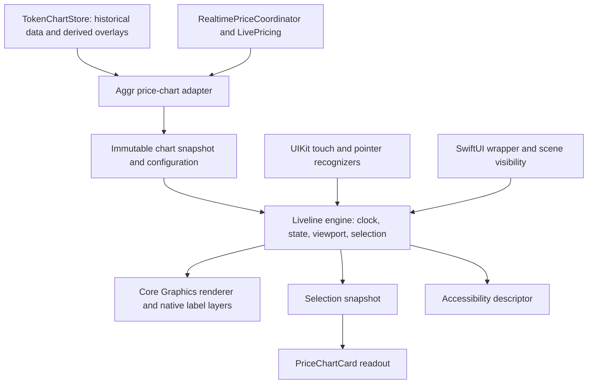

# Native Liveline port for aggr.watch iOS

Status: native token-chart implementation available in Debug builds; production cutover and full-library parity remain gated.
Date: September 13, 2026.

## Implementation update

`apps/ios/Packages/AggrLiveline` now contains the native engine, Core Graphics renderer, UIKit touch/lifecycle adapter, bundled MIT notice, original reference math, and independent numerical fixtures. `AggrPriceChart` connects it to the token page with existing market-cap/Hull/projection/volume behavior. Debug Xcode builds select it by default; Release keeps the legacy renderer until hardware validation. The developer override is `charts.useLegacyPriceRenderer`.

The final simulator verification passed 12 package tests, 21 existing app tests, and a token-page integration test covering all three timeframe controls, legend toggles, scrolling and repeated close/reopen. Xcode previews include token overlays, deterministic live replay, loading/pause, and tiny prices. The result bundle is `/tmp/aggr-liveline-validation-final.xcresult`. Numerical reference agreement is verified; complete browser/native motion parity and physical-device performance are not yet verified.

See [the implementation ledger](/Users/stevensarmi/Code/svela-prod/apps/ios/Packages/AggrLiveline/UPSTREAM.md) for implemented capabilities, explicit differences, reproducible checks, and pending work. Milestones 0–4 have implementation and simulator coverage, with remaining visual/device gates listed there. Milestones 5–7 are not complete. The original plan below remains the acceptance specification.

Follow-up fidelity pass: adapted the closer rendering behavior from `/Users/stevensarmi/Code/native`, including the spline reveal/retracting tip, dark-ring endpoint, curved pill badge, and animated chevrons. Fixed historical-refresh endpoint snapping, abrupt scrub dismissal, header height changes during inspection, and marker detachment during sudden range changes. All 41 simulator tests passed in `/tmp/aggr-liveline-fidelity-verified.xcresult`, intermediate animation frames were inspected, and the signed iPhone build succeeded inside Xcode. Full browser/native temporal parity and hardware performance certification remain pending.

## Recommendation and scope

Build a native Swift package, `AggrLiveline`, using UIKit, Core Graphics, Core Animation, and `CADisplayLink`, with a SwiftUI adapter. Port Liveline’s algorithms and animation state explicitly. Keep our existing market-data, pricing-trust, and indicator computation layers.

The first production destination is the token page’s price chart, including its overlays and volume pane. Ship that complete before replacing the overview, watchlist comparison, or small card charts. Those later migrations can reuse the engine. Keep specialized indicator panes on Swift Charts initially.

“1:1” means matching the reference geometry, motion, draw order, state changes, and interaction feedback against deterministic recordings. It does not mean exposing JavaScript/DOM types in Swift or copying browser input behavior. SF Rounded, touch handling, accessibility, device scale, and energy management are explicit native adaptations. Exact cross-platform pixel identity is not a credible promise because text and rasterization differ.

Use two documented configurations:

- **Reference:** pinned upstream behavior, for differential tests and visual comparison.
- **Aggr:** our web customizations, native input, current app typography/colors, historical viewports, overlays, and numerical fixes.

The app uses Aggr. This separation makes differences intentional and traceable, rather than slowly approximating the reference with unrelated animations.

## Audited baseline

Upstream checkout: `benjitaylor/liveline`, commit `069899598a11e00094ea1eb6b838404825f828be`, package version `0.0.7`. Source was inspected locally at `/tmp/aggr-liveline-upstream-20260913`; this temporary checkout is not a durable project dependency.

Our web lockfile resolves `liveline@0.0.7`, with both a Bun patch and a postinstall patcher. Matching version numbers do not establish that GitHub source and npm distribution are byte-for-byte equivalent; phase 0 records both artifacts.

Project HEAD at review: `aecb447c6974fa5b109a126eb9e468f909b942e7`, plus the current working-tree iOS changes. Preserve those changes during implementation.

| Baseline | Evidence and implication |
| --- | --- |
| Upstream engine | [useLivelineEngine.ts](https://github.com/benjitaylor/liveline/blob/069899598a11e00094ea1eb6b838404825f828be/src/useLivelineEngine.ts), 1,917 lines. Persistent display values, ranges, loading states, pause snapshots, and mode transitions live outside React rendering. |
| Upstream drawing | [draw/](https://github.com/benjitaylor/liveline/tree/069899598a11e00094ea1eb6b838404825f828be/src/draw): separate line, candle, multi-series, grid, time-axis, crosshair, badge, loading, dot, reference, order-book, and particle routines. |
| Public surface | [types.ts](https://github.com/benjitaylor/liveline/blob/069899598a11e00094ea1eb6b838404825f828be/src/types.ts) and [Liveline.tsx](https://github.com/benjitaylor/liveline/blob/069899598a11e00094ea1eb6b838404825f828be/src/Liveline.tsx). Line charts are only part of the library. |
| Our web patcher | [patch-liveline.mjs](/Users/stevensarmi/Code/svela-prod/apps/app/scripts/patch-liveline.mjs), SHA-256 `703f58f6908240940b9b4826558c956f4d547f2df5b81814be5f53830fa92eaa`. |
| Our Bun patch | [liveline@0.0.7.patch](/Users/stevensarmi/Code/svela-prod/patches/liveline@0.0.7.patch), SHA-256 `f77fd51115c965db0baf207730a20eec485842227d7574472a79530e9ae1d74b`. Makes configured line width apply to multi-series palettes too. |
| Native price renderer | [PriceChart.swift](/Users/stevensarmi/Code/svela-prod/apps/ios/AggrWatch/Charts/PriceChart.swift): Swift Charts marks and system selection. |
| Native integration | [PriceChartCard.swift](/Users/stevensarmi/Code/svela-prod/apps/ios/AggrWatch/Features/TokenDetail/PriceChartCard.swift), [TokenChartStore.swift](/Users/stevensarmi/Code/svela-prod/apps/ios/AggrWatch/Features/TokenDetail/TokenChartStore.swift). |
| Existing web token page | [price-chart.tsx](</Users/stevensarmi/Code/svela-prod/apps/app/src/app/[locale]/(dashboard)/watchlists/[id]/price-chart.tsx>) uses the lightweight-charts integration. Do not assume our current token page is already Liveline. |

The upstream MIT notice must accompany copied or adapted source and be included in the distributed app’s third-party notices. Keep its author attribution and [license](https://github.com/benjitaylor/liveline/blob/069899598a11e00094ea1eb6b838404825f828be/LICENSE), and record local modifications.

## What changes, and what must survive

| Current implementation | Planned implementation | Reason |
| --- | --- | --- |
| Swift Charts chooses interpolation, axes, selection behavior, and rendering | Dedicated engine controls all of these | Matching the library’s feel requires more than a different line shape. |
| Last plotted point directly receives the trusted live price | Feed a target observation into the native interpolation engine | Smooth updates without rebuilding the page every display frame. |
| Price chart selects one nearest point while its header separately reads stored historical data | One selection snapshot supplies curve position, timestamp, price, market cap, and projection values | Today a live-adjusted plotted endpoint can disagree with the header’s raw stored last price. |
| View-derived arrays and overlay calculations | Immutable, revisioned snapshots; cached geometry | Avoid repeated full-series work on every animation frame. |
| Current chart stays mounted around loading overlays | Explicit loading, empty, refreshing, stale, and data transition states | Preserve context and reproduce loading-to-line motion without manufacturing prices. |
| Independent price and volume chart layouts | Shared horizontal viewport and plot insets | Identical timestamps must occupy identical x coordinates across both panes. |

Required token-page behavior at cutover:

- Current 1M / 1Y / 2Y controls, Price / Mkt Cap toggles, formatting, and cached/live/stale status.
- White primary price line and subtle fill; market cap rebased to price at the shared anchor.
- Both MHULL and SHULL overlays, existing dashed styling, and forward bull/base/bear projection with its shaded band.
- High/low labels, historical period highlight, scrub price/percentage/date, market-cap readout, and projected values when scrubbing the future region.
- Volume pane and all existing error/warm-up handling.
- Existing token-page opening and dismissal behavior.

Calculations stay in `AggrCore`. The rendering package must not implement alternative financial calculations or own networking.

## Fidelity inventory

This is the completion ledger. A good-looking single line is a milestone, not a claim that the entire library has been ported.

| Feature family | Native treatment | Delivery |
| --- | --- | --- |
| Monotone curve, rounded strokes, gradient fill, edge fading | Port actual spline control-point and draw-order logic | First line milestone |
| Smoothed live endpoint, pulse, momentum arrows and colors | Same engine state and time-based interpolation; product flags govern visibility | First line milestone |
| Current-value badge, tail, variants, width and vertical easing | Native text/layers sharing engine geometry | First line milestone |
| Y range, grid hysteresis, labels fading, time-axis transitions | Reference algorithms plus explicit small-price/calendar fixes | First line milestone |
| Loading breathing line and center-out reveal; empty and pause/resume | Separate states with injectable clocks | First line milestone |
| Scrub crosshair, point, tooltip and value callbacks | Shared curve evaluation plus native gesture recognizer | Touch milestone |
| Time windows, formatting callbacks, reference line, padding, flags | Typed Swift configuration; native controls | Token integration |
| Market cap, Hull, projection, volume, period highlight | Aggr overlay extensions sharing one coordinate system | Required before token cutover |
| Multi-series, fades, toggles, labels, color and width | Port upstream behavior and our patch; collision handling on narrow screens | Subsequent engine milestone |
| Candles, live candle, line/candle morph and density transition | Port OHLC rendering and its distinct state machine | Subsequent parity milestone |
| `LivelineTransition` | Interruptible native crossfade of chart surfaces; separate from candle morph | Subsequent parity milestone |
| Order-book depth drawing | Engine capability with recorded fixtures; connect only if an actual depth source is available | Full-library parity milestone |
| Degen particles and shake | Optional capability, off in the app by default; seeded randomness for tests | Full-library parity milestone |
| React props, DOM value updates, CSS cursor and layout | Swift config/callbacks, UIKit/Core Text, pointer interaction and SwiftUI layout | Native equivalents |

Do not introduce candle/depth product controls with empty data just to imply feature completeness. Rendering capability and product data availability are separate acceptance items.

### Preserve our web refinements

Turn the patcher’s alterations into explicit configuration and tests:

1. Hide the automatic horizontal current-price guide when configured.
2. Hide the entire time axis when its labels are intentionally absent.
3. Evaluate scrub values on the same monotone spline as the visible curve.
4. Support disabling right-of-cursor dimming.
5. Let the app provide its own legend instead of duplicating built-in series chips.
6. Allow the live endpoint dot to be disabled independently of scrubbing.
7. Support horizontal and vertical dashed crosshairs with the patched contrast.
8. Keep the crosshair visible close to the live endpoint.
9. Resolve our OKLCH colors correctly; use typed native colors and the existing conversion.
10. Apply line width consistently in single- and multi-series modes.

Product-specific period highlighting remains a separate overlay. It must not accidentally re-enable the scrub dimming we removed on the web.

## Architecture



Proposed layout, not files created by this analysis:

```text
apps/ios/Packages/AggrLiveline/
  Package.swift
  Sources/AggrLiveline/
    Model/          # points, candles, revisions, config, selection snapshots
    Math/           # spline, interpolation, intervals, range, momentum
    Engine/         # clock, viewport, transition and render state
    Rendering/      # paths, axes, line, badge, crosshair, overlays
    UIKit/          # chart UIView, display-link driver, gesture arbitration
    SwiftUI/        # UIViewRepresentable adapter
    Accessibility/ # chart descriptor and adjustable selection
  Tests/AggrLivelineTests/
    Fixtures/       # JSON inputs and upstream expected outputs
  LICENSES/Liveline-MIT.txt
  UPSTREAM.md       # exact revision, reference provenance, deviations

apps/ios/AggrWatch/Charts/Liveline/
  AggrPriceChartAdapter.swift
  AggrPriceChartOverlays.swift
  AggrChartStyle.swift
  LivelineParityPreview.swift  # debug-only reference/replay controls
```

Keep this package independent of Clerk, Convex, app navigation, and `AggrAPI`. The app adapts `AggrCore.TimePoint` and overlay calculations to package models. Use `Double` epoch seconds inside the engine so subsecond live observations are representable; existing integer historical times convert exactly.

The UIView owns its renderer and display driver. The engine accepts an input snapshot and produces a frame state; drawing must not mutate the input history. UIKit updates occur on the main actor. Data preparation can run off-main using immutable Sendable snapshots, with generation checks before publication. The SwiftUI wrapper updates input revisions and callbacks; it does not publish a new whole-screen state every frame.

Start with `CGPath`, gradients, clipping, and cached native text metrics. Use native label views/layers for the live badge where useful, with implicit Core Animation disabled when the engine is driving geometry. All visible elements use the same frame snapshot. Benchmark this first; only consider a Metal renderer if measured device performance cannot meet the budget.

### Two clocks and explicit viewports

Use a monotonic animation clock for elapsed animation time and an independently supplied market timestamp for the data axis. A wall-clock correction must not create a backwards animation or a fictitious market observation.

Provide at least these viewport policies:

- `liveWindow(duration)`: upstream-style scrolling window with endpoint breathing room.
- `historical(range, projectionEnd)`: stable historical bounds plus the required future projection extent.
- `paused(snapshot)`: freeze the rendered history, values and viewport; resume from current targets smoothly.

Token pages use historical mode initially. Upstream uses wall-clock time plus a small right buffer; applying that unchanged would mishandle old data and clip or misrepresent our future projection region. Projection points never become historical observations or the live endpoint.

Important current naming detail: `TimeScale.max` is displayed as **1Y**. Token **1M** currently requests **90 days**, and **2Y** requests **max**; the current price view uses the returned bounds. Preserve those fetch contracts and initial displayed extents for the first integration. Separately decide whether labels should imply a cropped 30-/730-day viewport; that is a product behavior change, not a renderer fix. Extra history may also be necessary for indicator warm-up.

### Data and selection contracts

- Snapshot identity includes token ID, scale, data revision, and overlay revision. Never interpolate one token’s prices into another token’s prices.
- Scale changes retain the old coherent frame while new data loads. Apply the new data/domain together, and reject late completions from older requests.
- Normalize timestamps at the adapter boundary once; validate finite values, sorted order and duplicate policy. Preserve real gaps and never densify missing history into invented market data.
- Preserve `LivePricing` freshness/source checks. Pyth UI observations are currently throttled to about one second; render interpolation can still be smooth without increasing backend traffic or persistence frequency.
- A live observation carries source and timestamp. Treat it as a provisional endpoint, not a rewrite of stored historical bars. Append/update only through a defined observation policy; reject older ticks and resolve reconnection to a fresh snapshot.
- Warm-up placeholders are display state, not a candle dataset. The existing store can create a flat fallback; mark its provenance explicitly so it is not presented as observed market history.
- Selection returns the requested time, rendered curve value/position, nearest observed sample, and optional market-cap/projection values. Header and dot consume the same result. Preserve truthful distinction between an interpolated value and an observed candle.
- Our foreground row selection store remains unrelated to chart scrubbing.

## Motion specification

Copy measured behavior before tuning. Do not substitute the app’s generic `.snappy` spring for the chart engine’s continuous interpolation.

Verified reference values from the pinned engine:

| Behavior | Reference baseline |
| --- | --- |
| Frame-independent interpolation | `1 - pow(1 - speed, dt / 16.67)` |
| Base value smoothing | `0.08`, with adaptive boost |
| Frame delta cap | 50 ms |
| Scrub blend | `0.12` |
| Window transition | 750 ms, cosine easing and logarithmic span interpolation |
| Loading-to-data reveal | `0.09`; reverse `0.14`, with center-out drawing choreography |
| Series visibility | `0.10` |
| Badge width / position | `0.15` / `0.35`, position `0.5` during window transitions |
| Dot pulse | 1,500 ms interval, 900 ms duration |
| Candle width / line morph / density transition | 300 / 500 / 350 ms |
| Separate surface crossfade | 300 ms by default |

Keep these values in named configuration with reference tests. Device refresh rate changes the number of frames, not total perceived duration. The 750 ms window motion is deliberately retained for fidelity until compared on a device, even though it is longer than our toolbar transitions.

Reduced Motion must cover every moving layer, including loading shape, endpoint pulse, momentum arrows, particles, and camera shake—not only value interpolation. Keep updates legible with immediate state changes or a brief opacity change.

## Mobile interaction and rendering decisions

| Situation | Native behavior |
| --- | --- |
| Finger lands on plot | Begin as undecided; do not immediately prevent vertical scrolling. |
| Clearly horizontal movement | Claim chart scrubbing after a small directional threshold; proposal: 8 pt and horizontal dominance of 1.5×, then tune on hardware. |
| Clearly vertical movement before scrubbing | Let the surrounding scroll view win. |
| Hold still on plot | Optional 180 ms hold enters precise inspection with one light haptic. |
| Active scrub | Lock interaction to chart time; keep readout above the finger; crosshair and tooltip remain within bounds. |
| End/cancel/scene interruption | Release selection, haptics, and gesture ownership consistently; animate back to live/current display. |
| Page dismissal | Preserve `TokenPageDismissal`’s header-only start region. A plot gesture must never start page shrinking, and a header pull must not become a scrub. |
| Pinch or two-finger input | No new navigation behavior in the first release; these are not baseline Liveline controls. Define only if a later product requirement needs them. |
| iPad pointer | Hover inspection without requiring a tap; touch behavior remains available. |
| Accessibility | Chart summary, axes and series descriptor, adjustable sample inspection, and spoken selected values. Do not announce every live tick. |

Use UIKit gesture delegate coordination instead of stacking competing SwiftUI drag gestures. [Apple’s coordination guidance](https://developer.apple.com/documentation/uikit/coordinating-multiple-gesture-recognizers) documents failure ordering and simultaneous recognition.

Keep the existing 280 pt price plot and 56 pt volume pane as initial integration sizes. Use SF Rounded and shared formatter policy, measure actual label widths, and reserve space for the badge/y axis. Collapse optional information before shrinking text beyond legibility. Tooltip collision handling and larger accessibility layouts are required on narrow iPhones. Glass remains the surrounding card treatment; avoid adding a second blur pass across the plotted content.

Use `CADisplayLink` for display-synchronized updates and pause it when invisible, backgrounded, or settled without a continuing effect. Start with 60 fps parity; target 120 fps where supported after measurement. A requested rate is a hint, not a guarantee, and Low Power Mode and thermal conditions can change it. [Apple frame-rate guidance](https://developer.apple.com/documentation/quartzcore/cadisplaylink/preferredframeraterange).

Provide an [AXChartDescriptor](https://developer.apple.com/documentation/accessibility/axchartdescriptor); a custom canvas otherwise loses chart semantics supplied by Swift Charts.

### Numerical and behavioral fixes to declare

These are evidence-backed differences, not reasons to abandon the port:

- Upstream Y-grid identities use `round(value * 1000)`. Multiple sub-cent token labels can collide. Use interval-relative stable tick identities instead; include tiny-price fixtures.
- Upstream flat-series range fallback uses absolute spans of `0.4` or `0.04`. Use a scale-relative floor and price precision in the Aggr profile. The reference profile retains the original values for comparison.
- Upstream time ticks advance fixed second intervals after local-midnight alignment. For long native ranges, generate day/month/quarter boundaries with an explicit calendar/time-zone policy; test DST. Existing period highlighting uses UTC.
- Upstream’s linear hover evaluator differs from its monotone curve; our web patch corrects this. Native geometry and hover must share tangent coefficients.
- Our current price Y-domain considers MHULL but not SHULL separately. The replacement must include every visible overlay extent, live target, and projection bound.
- The current header independently looks up stored samples while the line can display an adjusted live endpoint. Eliminate that mismatch through the shared selection result.

## Implementation sequence and exit gates

Each milestone leaves a runnable preview or complete app flow. The default renderer remains the existing one until the token integration passes its gates.

| Milestone | Work | Exit gate |
| --- | --- | --- |
| 0. Freeze and capture | Vendor reference provenance/license; record npm distribution plus both web patches; build a deterministic JS replay fixture runner and debug native gallery. Save baseline current-token screenshots and gesture recordings. | Same timestamps, observations, dimensions and configuration can be replayed in web and native. Every matrix item has a fixture or an explicit pending status. |
| 1. Native line vertical slice | Add package/project wiring; implement frame clock, monotone geometry, line/fill, live value interpolation, endpoint, Y range and axes; mount a debug chart in SwiftUI. | BTC and tiny-price fixtures render and animate on device. Mathematical output agrees with the reference. No networking or whole-view updates per frame. |
| 2. Liveline line behavior | Add badge, momentum, loading reveal, empty, pause/resume, window changes, reference line, formatting and appearance flags. Port our web customizations. | Deterministic recordings agree on geometry, choreography and timing; mid-transition reversals do not jump or leave stale layers. |
| 3. Touch and access | Implement direction-aware scrub, readout callback, pointer support, reduced motion, accessibility descriptor, visibility lifecycle. | Vertical scrolling, horizontal inspection and header dismissal work together; interrupted touches and repeated page open/close leave no locked state. |
| 4. Complete token integration | Adapter for current history/live pricing; market-cap rebase, both Hull lines, projection, period highlight, extrema and aligned volume. Integrate into `PriceChartCard` behind a debug/internal renderer switch. | Existing 1M/1Y/2Y, legend toggles, live/stale handling, scrub values and projected readouts all work with no feature loss. |
| 5. Production cutover | Device profiling, low-power tests, regression pass; enable native renderer as the app default. Keep a temporary developer rollback switch. | Performance and correctness budgets below pass; no active renderer continues rendering behind the new one. Remove fallback only after a stable validation cycle. |
| 6. Multi-series reuse | Port multi-series behavior and label management, then individually migrate Watchlists, Compare, and Overview. Migrate small price sparklines only after measuring list cost. | Normalization, hidden-series semantics, reference baselines and selection stay correct on every migrated surface. Small watchlist-card charts remain white at the opacity already chosen. |
| 7. Complete optional engine parity | Candles/live-candle, line/candle density morph, surface transition, order-book and degen effects, using explicit data fixtures. | Full-library ledger completed; features lacking production feeds remain unexposed, not represented as working app controls. |

Milestone 5 is completion of the requested token price-chart overhaul. Milestone 7 is the point at which we can claim the broader library capability port is complete. Do not silently equate the two.

## Verification and budgets

### Reference and correctness

Port the existing upstream math tests, then strengthen them with cross-language golden outputs. Add tests for spline control points and evaluating the same curve, nonuniform timestamps, duplicate cleanup, single/empty/flat series, sub-cent values, negative normalized returns, outliers, label identity, hidden-series ranges, and late data generations.

Replay 30/60/120 Hz frame schedules and irregular frame timing using an injected clock. Compare computed engine state at equal elapsed times. Capture scripted loading → data, live jumps, interval changes, pause/resume, scrubbing near the tip, all-series-hidden, and candle morphs. Use a seeded generator for decorative randomness.

Set mathematical tolerances by normalized scale (initial target: relative `1e-8` where stable). Compare raster output with aligned plot dimensions; permit font/antialiasing differences, but investigate curve or cursor displacement above 1 logical point. Test transition timing within one 60 Hz frame at matched clock inputs. These are proposed acceptance targets, not results already measured.

For Aggr-specific overlays, test market-cap rebase anchors, SHULL/MHULL extrema, real/future boundary, selection readout consistency and exact x-alignment with volume. Observed values must remain unchanged by smoothing, projection, or display decimation.

### Device interaction

Exercise a compact iPhone, a ProMotion iPhone, and iPad in split view. Cover slow and fast scrubs, diagonal drags, scroll starts inside the chart, range changes during loading, live updates during inspection, opening another token, foreground/background, Reduce Motion, VoiceOver, Low Power Mode, and the existing row-origin page dismissal regressions.

UI tests verify state transitions and data consistency; videos verify motion quality. Simulator screenshots alone cannot prove animation performance or touch feel.

### Performance

Proposed initial budgets for the complete price chart plus overlays:

- Sustain 60 fps during interaction on the agreed baseline device; aim for 120 fps on ProMotion when it can be maintained.
- Keep main-thread chart update/draw work below 8 ms p95 at 60 Hz and 4 ms p95 at 120 Hz, leaving frame time for page scrolling and system compositing.
- Zero display-link callbacks once fully offscreen/backgrounded; settle and stop non-live static charts.
- No growing allocation trend after 50 token open/close cycles; no surviving display-link retain cycle or duplicate stream subscription.
- Profile at approximately 200, 2,000 and 10,000 points, plus the actual production datasets. If decimation is needed, preserve endpoints and extrema, validate visible geometry error, and retain the original history for values/indicators. Do not reuse even-spacing downsampling blindly for the primary price plot.
- Use Instruments to measure, not just an on-screen fps counter. Keep line geometry, label measurements and data preparation cached by revision; a static input should not produce fresh full-series arrays every frame.

## Decisions and limits of this analysis

Recommended defaults: native UIKit renderer; Aggr profile; preserve token time-range behavior initially; white price curve/SF Rounded; touch-first scrubbing; no new candle or order-book UI; optional effects off. These can be adjusted without changing the package boundary.

Before changing timeframe meaning or enabling additional product modes, settle those product choices explicitly. They do not block building the reference harness or first native line slice.

This review inspected source, current integrations, web patches, and Apple documentation. It did not implement or benchmark a renderer, watch a synchronized native/web playback, or validate production candle/depth feeds. The first milestone exists to turn those unknowns into concrete evidence before a broad rollout.

The immediate next implementation task is milestone 0 plus the milestone 1 vertical slice: an isolated, replayable native chart preview with one fixed fixture and one live-observation replay. Its acceptance is recognizable Liveline geometry and motion on an iPhone, backed by matching numerical outputs.
